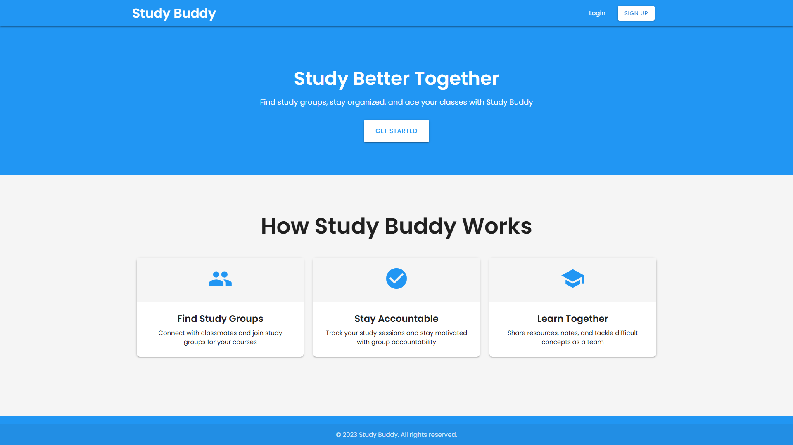
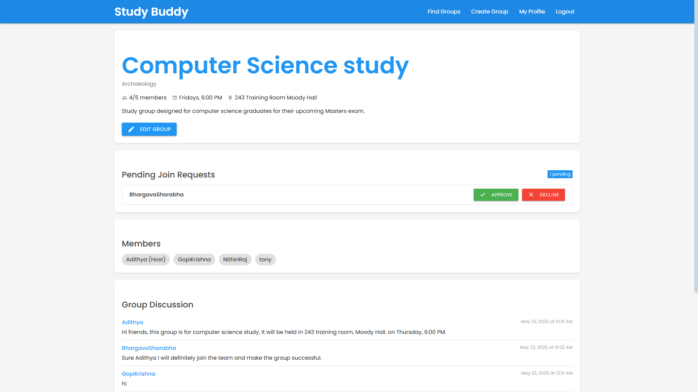
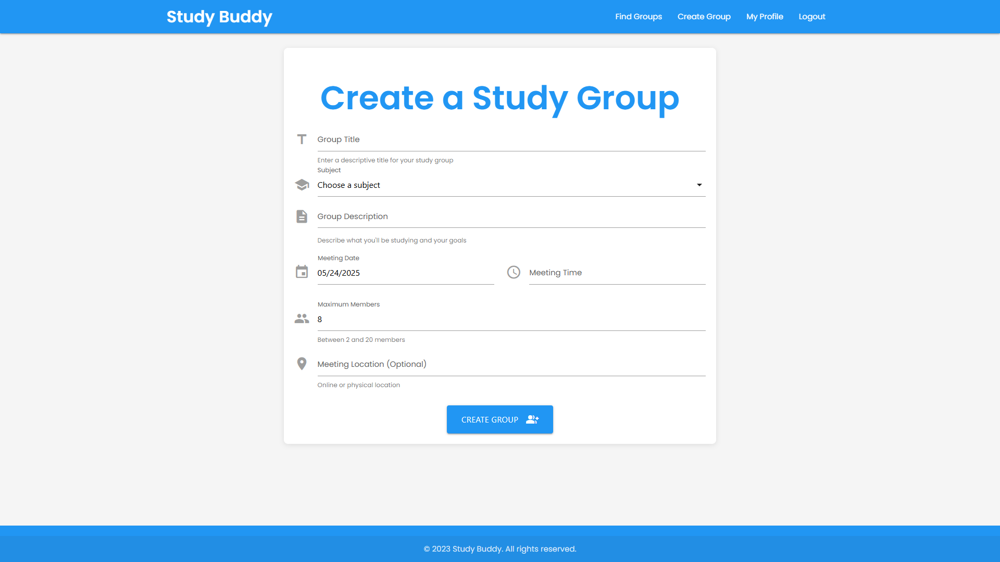
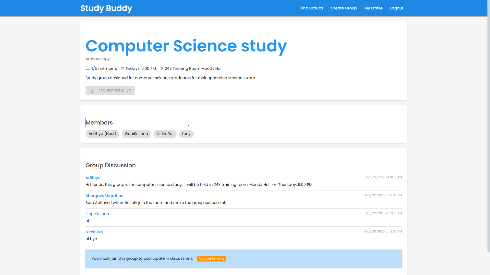
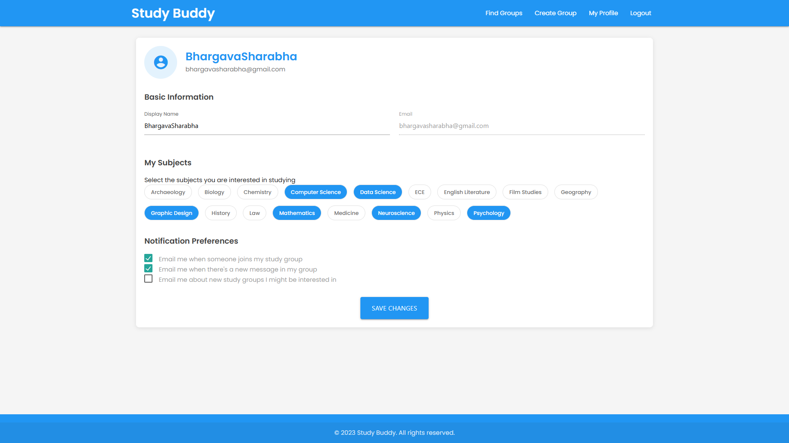

# StudyBuddy - Collaborative Learning Platform



## Overview

StudyBuddy is a web-based collaborative learning platform that connects students with similar academic interests. It enables users to create, join, and manage study groups organized by subject, schedule group sessions, and collaborate through real-time discussions. The platform streamlines the process of finding study partners and provides tools for effective group study management.

## Live Demo

[Live Demo](https://studybuddy-demo.herokuapp.com) - *Coming Soon*

## Key Features

### User Authentication System
- Secure registration and login functionality
- User profile creation and management
- Password reset capabilities

### Study Group Management
- Create study groups with detailed information (subject, schedule, location)
- Browse available study groups with filtering by subject
- Membership request and approval system for group joining
- Group editing capabilities for hosts

### Interactive Dashboards
- User-specific dashboard showing joined groups
- Group-specific dashboards with member information
- Real-time status updates on group activities

### Real-time Group Discussions
- In-group messaging system
- Chronological message display with user attribution
- Seamless message posting interface

### User Profile System
- Subject interest selection
- Profile customization options
- User activity tracking

## Technologies Used

### Backend
- **Python 3.11** - Core programming language
- **Django 5.2** - Web framework for rapid development
- **SQLite** - Database for development (can be migrated to PostgreSQL for production)
- **Django ORM** - Object-Relational Mapping for database interactions

### Frontend
- **HTML5/CSS3** - Structure and styling
- **Materialize CSS** - Modern and responsive UI components
- **JavaScript** - Client-side interactivity
- **Material Icons** - Visual iconography

### Security Features
- **CSRF Protection** - Cross-Site Request Forgery prevention
- **Password Hashing** - Secure password storage
- **Django Security Middleware** - Protection against common vulnerabilities
- **Permission-Based Access Control** - Role-based access to features

### DevOps & Deployment
- **Git/GitHub** - Version control
- **Virtual Environment** - Dependency isolation
- **Requirements.txt** - Dependency management

## Technical Implementation Details

### Database Schema

The application utilizes a relational database with the following key models:

- **User Model** (Extended Django User)
  - Authentication fields
  - Profile information
  - Relationships to groups and subjects

- **StudyGroup Model**
  - Title, description
  - Subject (Foreign Key)
  - Host (User Foreign Key)
  - Members (Many-to-Many through GroupMembership)
  - Meeting details (date, time, location)
  - Member limit

- **GroupMembership Model**
  - Tracks membership relationships
  - Stores membership dates
  - Membership status

- **GroupJoinRequest Model**
  - Implements approval workflow
  - Tracks request status (pending, approved, declined)
  - Timestamps for requests and responses

- **GroupMessage Model**
  - Message content storage
  - Relationship to groups and users
  - Timestamp information

- **Subject Model**
  - Subject categories
  - Relationships to users and groups

### Core Functionality Implementation

#### Group Membership Approval System
The system implements a sophisticated membership request and approval workflow:

```python
# Simplified code sample of the join request system
@login_required
def join_group(request, group_id):
    try:
        group = StudyGroup.objects.get(id=group_id)
        
        # Check constraints (membership, pending requests, capacity)
        if group.members.filter(id=request.user.id).exists():
            messages.warning(request, "You are already a member of this group.")
        elif GroupJoinRequest.objects.filter(user=request.user, group=group, status='pending').exists():
            messages.info(request, "You already have a pending request to join this group.")
        elif group.is_full:
            messages.error(request, "This group is already full.")
        else:
            # Handle existing declined requests or create new
            existing_request = GroupJoinRequest.objects.filter(
                user=request.user, 
                group=group, 
                status='declined'
            ).first()
            
            if existing_request:
                # Update existing request
                existing_request.status = 'pending'
                existing_request.requested_at = timezone.now()
                existing_request.responded_at = None
                existing_request.save()
            else:
                # Create new request
                GroupJoinRequest.objects.create(
                    user=request.user,
                    group=group,
                    status='pending'
                )
            messages.success(request, f"Your request to join {group.title} has been sent!")
    except StudyGroup.DoesNotExist:
        messages.error(request, "Study group not found.")
    
    return redirect('group_details', group_id=group_id)
```

#### Real-time Group Discussion
The messaging system implements real-time updates with chronological ordering:

```python
# Simplified code sample for the messaging system
@login_required
def group_details(request, group_id=None):
    if group_id:
        group = StudyGroup.objects.get(id=group_id)
        
        # Check permissions
        is_member = group.members.filter(id=request.user.id).exists()
        is_host = group.host == request.user
        
        # Get messages with proper ordering
        messages_list = group.messages.all().order_by('timestamp')
        
        # Handle message posting
        if request.method == 'POST' and (is_member or is_host):
            message_content = request.POST.get('message')
            if message_content:
                GroupMessage.objects.create(
                    group=group,
                    user=request.user,
                    content=message_content
                )
                return redirect('group_details', group_id=group.id)
```

#### Capacity Management System
The platform ensures group capacity limitations are enforced both in the UI and backend:

```python
# Capacity validation in group editing
@login_required
def edit_group(request, group_id):
    # ... other code ...
    
    # Ensure max_members isn't below current count
    current_member_count = group.current_member_count
    try:
        max_members = int(max_members)
        if max_members < current_member_count:
            messages.error(request, f"Maximum members cannot be less than the current member count ({current_member_count}).")
            return render(request, 'userDashboard/edit_group.html', {
                'group': group,
                'subjects': subjects
            })
    except ValueError:
        messages.error(request, "Invalid maximum members value.")
```

## Project Structure

```
StudyBuddy/
├── ProjStudyBuddy/           # Project configuration
├── userAuth/                 # Authentication app
├── userProfile/              # User profile management app
├── userDashboard/            # Dashboard & group functionality app
├── projLanding/              # Landing page app
├── manage.py                 # Django management script
├── requirements.txt          # Project dependencies
└── db.sqlite3                # Development database
```

## Screenshots

### Landing Page

*The landing page introduces users to StudyBuddy features and benefits.*

### User Dashboard

*The dashboard displays available study groups with filtering options.*

### Group Details

*Group detail page shows comprehensive information and discussion area.*

### Create/Edit Group

*Interface for creating or editing study groups with comprehensive options.*

### Join Request System

*Group hosts can approve or decline join requests from the interface.*

### User Profile

*Users can customize their profiles and select subjects of interest.*

## Installation and Setup

1. Clone the repository:
   ```bash
   git clone https://github.com/yourusername/StudyBuddy.git
   cd StudyBuddy
   ```

2. Create and activate a virtual environment:
   ```bash
   python -m venv venv
   source venv/bin/activate  # On Windows: venv\Scripts\activate
   ```

3. Install dependencies:
   ```bash
   pip install -r requirements.txt
   ```

4. Run migrations:
   ```bash
   python manage.py migrate
   ```

5. Create a superuser:
   ```bash
   python manage.py createsuperuser
   ```

6. Run the development server:
   ```bash
   python manage.py runserver
   ```

7. Access the application at http://127.0.0.1:8000/

## Future Roadmap

### Short-term Enhancements
- Advanced search functionality with more filters
- Email notifications for group activities
- Calendar integration for study sessions

### Medium-term Features
- **File Sharing in Group Discussions**
  - Secure document uploading and downloading
  - Preview capabilities for common file formats
  - Permission-based access to shared files
  - Version control for uploaded documents

- **Resource Library**
  - Categorized study materials
  - Rating and commenting system
  - Search functionality for resources

### Long-term Vision
- **Video Conferencing for Study Groups**
  - Real-time video meetings integration
  - Screen sharing capabilities
  - Interactive whiteboard
  - Recording options for sessions
  
- **Mobile Application**
  - Native iOS and Android versions
  - Push notifications
  - Offline content access

- **AI Study Assistant**
  - Personalized learning recommendations
  - Study schedule optimization
  - Content summarization

## Contribution Guidelines

1. Fork the repository
2. Create a feature branch: `git checkout -b feature-name`
3. Commit your changes: `git commit -m 'Add some feature'`
4. Push to the branch: `git push origin feature-name`
5. Submit a pull request

## License

This project is licensed under the MIT License - see the [LICENSE](LICENSE) file for details.

## Contact

- Developer: [Gopi Krishna Gajam](mailto:gopi.gopikrishna204@gmail.com)
- GitHub: [Gopi Krishna Gajam](https://github.com/gopikrishnagajam)
- LinkedIn: [Gopi Krishna Gajam](https://www.linkedin.com/in/gopikrishnagajam/)
